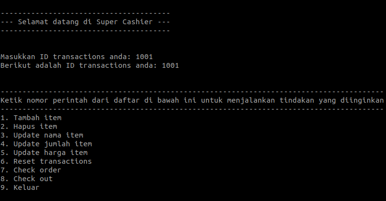

# Super Cashier

## Background

---

Aplikasi kasir self-service dengan menggunakan Python. Dengan Super Cashier, Customer dapat dengan mudah **menambah**, **menghapus**, **mengubah**, dan melakukan **checkout** pada item belanjaan mereka.



## Requirements

---

Sebelum menggunakan Super Cashier, pastikan sudah terinstall:

- Python
- SQLite
- PrettyTable
- SQLAlchemy

## Cara Menggunakan

---

1. Clone repository ini

   ```
   git clone https://github.com/sirilius/super-cashier.git
   ```

2. Buka terminal atau command prompt
3. Masuk ke direktori yang terdapat file repository Super Cashier-nya.
4. Jalankan perintah `python main.py`

## Tools

---

**Language:**

- Python

**Libraries:**

- PrettyTable
- SQLAlchemy

## Objective

---

**Learning objective:**

- Membuat aplikasi kasir self-service menggunakan Python
- Menghubungkan program Python ke database SQLite
- Menerapkan konsep OOP dalam pembuatan aplikasi
- Menuliskan kode Python yang bersih dan mudah dibaca dengan menerapkan prinsip PEP8

**Program objective:**

- Menambahkan item belanjaan baru ke Super Cashier
- Menghapus item belanjaan yang sudah tidak diinginkan Customer
- Mengubah informasi item belanjaan seperti nama, jumlah, dan harga
- Mencari item belanjaan berdasarkan nama
- Melakukan checkout dan menghitung total harga belanjaan
- Menyimpan daftar belanjaan Customer dalam database

## Code Flow

---

1. User memulai program Super Cashier.
2. Program menampilkan menu utama pilihan aksi yang dapat dilakukan oleh user: "Tambah item", "Hapus item", "Update nama item", "Update jumlah item", "Update harga item", "Reset transactions", "Check order", "Check out", dan "Keluar".
3. User memilih salah satu dari opsi yang tersedia di menu utama.
4. Jika user memilih "Tambah item", program akan meminta user untuk memasukkan nama item, jumlah, dan harga item. Setelah data tersebut dimasukkan, item akan ditambahkan ke dalam daftar belanjaan.
5. Jika user memilih "Hapus item", program akan meminta user untuk memasukkan nama item yang ingin dihapus. Setelah nama item tersebut dimasukkan, item akan dihapus dari daftar belanjaan.
6. Jika user memilih "Update nama item", program akan meminta user untuk memasukkan nama item yang ingin diubah dan nama item yang baru. Setelah data tersebut dimasukkan, nama item akan diubah di dalam daftar belanjaan.
7. Jika user memilih "Update jumlah item", program akan meminta user untuk memasukkan nama item yang ingin diubah dan jumlah item yang baru. Setelah data tersebut dimasukkan, jumlah item akan diubah di dalam daftar belanjaan.
8. Jika user memilih "Update harga item", program akan meminta user untuk memasukkan nama item yang ingin diubah dan harga item yang baru. Setelah data tersebut dimasukkan, harga item akan diubah di dalam daftar belanjaan.
9. Jika user memilih "Reset transactions", program akan menghapus semua item belanjaan yang telah dimasukkan sebelumnya dan memulai transaksi baru.
10. Jika user memilih "Check order", program akan menampilkan daftar item belanjaan yang telah dimasukkan.
11. Jika user memilih "Check out", program akan menampilkan daftar item belanjaan yang telah dimasukkan dan menyimpannya ke dalam database
12. Jika user memilih "Keluar", program akan keluar dari program Super Cashier.

## Code Overview

---

### 1. Import library yang dibutuhkan

```
# Import library SQLAlchemy untuk mengakses database
from sqlalchemy import create_engine

# Import library text dari SQLAlchemy untuk mempermudah penulisan query
from sqlalchemy import text

# Import library PrettyTable untuk memperindah tampilan output tabel
from prettytable import PrettyTable

```

### 2. Kelas Transaction

```
class Transaction:
    """
    Kelas untuk merepresentasikan sebuah transaksi belanja.

    Attributes
    ----------
    daftar_belanja : dict
        Variabel global untuk menyimpan daftar belanja yang terdiri dari
        nama_item, jumlah_item, harga_per_item, dan harga_total.
    """

    daftar_belanja = {"nama_item": [], "jumlah_item": [],
                      "harga_per_item": [], "harga_total": []}
```

### 3. Constructor untuk kelas Transaction

```
def __init__(self):
        """
        Konstruktor kelas Transaction.

        Menampilkan pesan selamat datang dan menginisiasi ID transactions.
        Menerima input nomor perintah untuk menjalankan tindakan yang diinginkan.

        Attributes
        ----------
        id_transaction : int
            input nomor ID transaksi yang dimasukkan oleh pengguna pada saat memulai transaksi.
        """

        # Menampilkan pesan selamat datang
        print("\n")
        print("-"*39)
        print("--- Selamat datang di Super Cashier ---")
        print("-"*39)
        print("\n")

        # Loop untuk menginput ID transactions dengan pengecekan apakah input berupa angka atau bukan
        while True:
            try:
                id_transaction = int(input("Masukkan ID transactions anda: "))
                print(
                    f"Berikut adalah ID transactions anda: {id_transaction}")
                print("\n")
                break
            except ValueError:
                print("Terjadi kesalahan input, ID transactions harus berupa angka")
                continue

        # Loop untuk menampilkan daftar perintah yang tersedia dan mengeksekusi perintah yang diinputkan
        while True:
            # Menampilkan pesan yang meminta pengguna untuk memilih perintah
            print("-" * 88)
            print(
                "Ketik nomor perintah dari daftar di bawah ini untuk menjalankan tindakan yang diinginkan"
            )
            print("-" * 88)
            print("1. Tambah item")
            print("2. Hapus item")
            print("3. Update nama item")
            print("4. Update jumlah item")
            print("5. Update harga item")
            print("6. Reset transactions")
            print("7. Check order")
            print("8. Check out")
            print("9. Keluar")
            print("\n")

            try:
                # Meminta input dari pengguna berupa nomor perintah
                selected_option = int(input("Ketik nomor perintah: "))

                # Menjalankan perintah sesuai dengan nomor yang dipilih pengguna
                if selected_option == 1:
                    self.add_item()
                    print("\n")
                elif selected_option == 2:
                    self.delete_item()
                    print("\n")
                elif selected_option == 3:
                    self.update_item_name()
                    print("\n")
                elif selected_option == 4:
                    self.update_item_qty()
                    print("\n")
                elif selected_option == 5:
                    self.update_item_price()
                    print("\n")
                elif selected_option == 6:
                    self.reset_transaction()
                    print("\n")
                elif selected_option == 7:
                    self.check_order()
                    print("\n")
                elif selected_option == 8:
                    self.check_out()
                    print("\n")
                elif selected_option == 9:
                    # Menampilkan pesan terima kasih dan keluar dari program
                    print("\n")
                    print("-"*45)
                    print("Terima kasih telah menggunakan Super Cashier!")
                    print("-"*45)
                    print("\n")
                    exit()
                else:
                    # Menampilkan pesan error jika nomor perintah yang dimasukkan tidak valid
                    print(
                        "Terjadi kesalahan, pastikan anda memasukkan nomor perintah yang benar.")
                    print("\n")
            except ValueError:
                # Menampilkan pesan error jika input nomor perintah tidak berupa angka
                print("Terjadi kesalahan, nomor perintah harus berupa angka")
                print("\n")
                continue
```

### 4. Function `add_item()`

```
def add_item(self):
        """
        Fungsi untuk menambahkan item baru ke dalam daftar belanja.

        Attributes
        ----------
        input_nama_item : str
            Nama item yang dimasukkan oleh pengguna.
        input_jumlah_item : int
            Jumlah item yang dimasukkan oleh pengguna.
        input_harga_item : int
            Harga per item yang dimasukkan oleh pengguna.
        """

        # Meminta pengguna memasukkan nama item yang ingin ditambahkan
        input_nama_item = input("Masukkan nama item: ")

        # Validasi dan minta pengguna memasukkan jumlah item yang ingin ditambahkan
        while True:
            try:
                input_jumlah_item = int(input("Masukkan jumlah item: "))
                break
            except ValueError:
                print("Terjadi kesalahan, jumlah item harus berupa angka")
                continue

        # Validasi dan minta pengguna memasukkan harga item yang ingin ditambahkan
        while True:
            try:
                input_harga_item = int(input("Masukkan harga per item: "))
                break
            except ValueError:
                print("Terjadi kesalahan, harga per item harus berupa angka")
                continue

        # Menambahkan item ke dalam dictionary daftar belanja
        self.daftar_belanja["nama_item"].append(input_nama_item)
        self.daftar_belanja["jumlah_item"].append(input_jumlah_item)
        self.daftar_belanja["harga_per_item"].append(input_harga_item)
        self.daftar_belanja["harga_total"].append(
            input_harga_item * input_jumlah_item)

        # Menampilkan pesan item berhasil ditambahkan ke daftar belanja
        print("\n")
        print("-"*26)
        print("Item berhasil ditambahkan!")
        print("-"*26)
```

### 5. Function `delete_item()`

```
def delete_item(self):
        """
        Fungsi untuk menghapus item dari daftar belanja.

        Attributes
        ----------
        item_to_delete : str
            Berisi input untuk nama item yang ingin dihapus dari daftar belanja.
        index_nama_item : int
            Menyimpan index dari item yang akan dihapus dari daftar belanja.
        """

        while True:
            # Meminta user untuk memasukkan nama item yang ingin dihapus
            item_to_delete = input("Masukkan nama item yang ingin dihapus: ")

            # Jika item_to_delete ada dalam list nama_item pada dictionary daftar_belanja
            if item_to_delete in self.daftar_belanja["nama_item"]:
                # Hapus item yang memiliki index yang sama dengan index_nama_item pada setiap key dalam dictionary daftar_belanja
                index_nama_item = self.daftar_belanja["nama_item"].index(
                    item_to_delete)
                for key in list(self.daftar_belanja.keys()):
                    del self.daftar_belanja[key][index_nama_item]

                # Tampilkan pesan bahwa item berhasil dihapus
                print("\n")
                print("-"*47)
                print("----------- Item berhasil dihapus! ------------")
                print("-"*47)
                # Tampilkan pesan agar user mengetik 'q' untuk keluar dari perintah hapus item
                print("Ketik 'q' untuk keluar dari perintah hapus item")
                print("\n")
            # Jika user mengetik 'q', keluar dari loop while
            elif item_to_delete == "q":
                break
            # Jika item_to_delete tidak ada pada list nama_item, tampilkan pesan error
            else:
                print("Terjadi kesalahan, tidak ada item dengan nama tersebut")
```

### 6. Function `update_item_name()`

```
def update_item_name(self):
        """
        Fungsi untuk mengupdate nama suatu item pada daftar belanja.

        Attributes
        ----------
        updated_item_name : str
            variabel untuk menyimpan nama item yang baru diinput oleh pengguna
        item_to_update : str
            variabel untuk menyimpan nama item yang ingin di-update oleh pengguna
        index_nama_item : int
            variabel untuk menyimpan index nama item yang ingin di-update pada list 'nama_item' di dalam dictionary 'daftar_belanja'
        """

        while True:
            # Meminta user untuk memasukkan nama item yang ingin diubah namanya
            item_to_update = input("Masukkan nama item yang ingin di-update: ")

            # cek apakah item yang ingin di-update ada di dalam dictionary daftar_belanja
            if item_to_update in self.daftar_belanja["nama_item"]:
                # input dari pengguna berupa nama baru untuk item yang ingin di-update
                updated_item_name = input("Masukkan nama item yang baru: ")

                # mencari index dari item yang ingin di-update di dalam dictionary daftar_belanja
                index_nama_item = self.daftar_belanja["nama_item"].index(
                    item_to_update)
                # update nama item pada index yang ditemukan sebelumnya dengan nama item yang baru
                self.daftar_belanja["nama_item"][index_nama_item] = updated_item_name

                # Tampilkan pesan bahwa item berhasil di-update
                print("\n")
                print("-"*48)
                print("----------- Item berhasil di-update! -----------")
                print("-"*48)
                # Tampilkan pesan agar user mengetik 'q' untuk keluar dari perintah hapus item
                print("Ketik 'q' untuk keluar dari perintah update item")
                print("\n")
            # Jika user mengetik 'q', keluar dari loop while
            elif item_to_update == "q":
                break
            # jika item yang ingin di-update tidak ada dalam dictionary daftar_belanja, maka tampilkan pesan error
            else:
                print("Terjadi kesalahan, tidak ada item dengan nama tersebut")
```

### 7. Function `update_item_qty()`

```
def update_item_qty(self):
        """
        Fungsi untuk update jumlah item dalam daftar belanja dengan menentukan nama item yang ingin diubah dan memasukkan jumlah item yang baru.

        Attributes
        ----------
        item_to_update : str
            Nama item yang ingin diubah jumlahnya.
        updated_jumlah_item : int
            Jumlah item yang baru.
        index_jumlah_item : int
            Indeks dari jumlah item dalam daftar belanja.
        """

        while True:
            # Meminta user untuk memasukkan nama item yang ingin diubah jumlahnya
            item_to_update = input(
                "Masukan nama item yang ingin diubah jumlahnya: ")

            # Jika item yang diminta ada dalam daftar belanja, maka lanjutkan
            if item_to_update in self.daftar_belanja["nama_item"]:
                # Membuat loop while yang berjalan terus menerus sampai input dari user berupa integer
                while True:
                    try:
                        # Meminta input dari user mengenai jumlah item yang baru
                        updated_jumlah_item = int(input(
                            "Masukkan jumlah item yang baru: "))
                        break
                    except ValueError:
                        # Jika input bukan integer, tampilkan pesan error
                        print("Terjadi kesalahan, jumlah item harus berupa angka")
                        continue
                # Mencari index dari item yang ingin diubah jumlahnya
                index_jumlah_item = self.daftar_belanja["nama_item"].index(
                    item_to_update)

                # Mengubah jumlah item pada index yang ditemukan dengan jumlah item yang baru
                self.daftar_belanja["jumlah_item"][index_jumlah_item] = updated_jumlah_item

                # Mengubah harga total pada index yang ditemukan dengan perkalian jumlah item yang baru dengan harga per item
                self.daftar_belanja["harga_total"][index_jumlah_item] = (
                    updated_jumlah_item *
                    self.daftar_belanja["harga_per_item"][index_jumlah_item]
                )

                # Menampilkan pesan berhasil
                print("\n")
                print("-"*55)
                print("-------------- Item berhasil di-update! ---------------")
                print("-"*55)
                # Tampilkan pesan agar user mengetik 'q' untuk keluar dari perintah hapus item
                print("Ketik 'q' untuk keluar dari perintah update jumlah item")
                print("\n")
            # Jika user memilih keluar, maka break dari loop while terluar
            elif item_to_update == "q":
                break
            # Jika item yang diminta tidak ada dalam daftar belanja, maka tampilkan pesan error
            else:
                print("Terjadi kesalahan, tidak ada item dengan nama tersebut")
```

### 8. Function `update_item_price()`

```
def update_item_price(self):
        """
        Fungsi untuk mengubah harga per item suatu item pada daftar belanja.

        Attributes
        ----------
        item_to_update : str
            nama item yang akan diubah harganya
        updated_harga_item : int
            harga baru untuk item yang akan diubah
        index_harga_item : int
            indeks dari item yang akan diubah harganya dalam daftar belanja
        """

        while True:
            # Meminta user untuk memasukkan nama item yang ingin diubah harganya
            item_to_update = input(
                "Masukan nama item yang ingin diubah harganya: ")

            # jika item ada di dalam daftar belanja
            if item_to_update in self.daftar_belanja["nama_item"]:
                while True:
                    try:
                        # meminta input harga item yang baru
                        updated_harga_item = int(input(
                            "Masukkan harga per item yang baru: "))
                        break
                    except ValueError:
                        # jika input bukan berupa integer, meminta input lagi
                        print("Terjadi kesalahan, harga per item harus berupa angka")
                        continue
                # mendapatkan index item yang akan diupdate harganya
                index_harga_item = self.daftar_belanja["nama_item"].index(
                    item_to_update)
                # memperbarui harga per item di daftar belanja
                self.daftar_belanja["harga_per_item"][index_harga_item] = updated_harga_item

                # memperbarui harga total item di daftar belanja
                self.daftar_belanja["harga_total"][index_harga_item] = (
                    updated_harga_item *
                    self.daftar_belanja["jumlah_item"][index_harga_item]
                )

                # Menampilkan pesan berhasil
                print("\n")
                print("-"*55)
                print("-------------- Item berhasil di-update! ---------------")
                print("-"*55)
                # Tampilkan pesan agar user mengetik 'q' untuk keluar dari perintah hapus item
                print("Ketik 'q' untuk keluar dari perintah update jumlah item")
                print("\n")
            # Jika user memilih keluar, maka break dari loop while terluar
            elif item_to_update == "q":
                break
            # Jika item yang diminta tidak ada dalam daftar belanja, maka tampilkan pesan error
            else:
                print("Terjadi kesalahan, tidak ada item dengan nama tersebut")
```

### 9. Function `reset_transaction()`

```
def reset_transaction(self):
        """
        Fungsi untuk mereset seluruh transactions pada daftar belanja menjadi kosong.

        Attributes
        ----------
        Tidak ada attribute di dalam fungsi reset_transaction
        """

        # Menghapus setiap daftar belanja pada tiap key pada self.daftar_belanja
        for key in list(self.daftar_belanja.keys()):
            del self.daftar_belanja[key][:]

        # Menampilkan pesan konfirmasi bahwa seluruh transactions telah direset
        print("\n")
        print("-"*47)
        print("----- Seluruh transactions berhasil direset! -----")
        print("-"*47)
```

### 10. Function `check_order()`

```
def check_order(self):
        """
        Fungsi untuk mengecek daftar belanja

        Attributes
        ----------
        Tidak ada attribute di dalam fungsi check_order
        """

        # Jika belum ada item yang ditambahkan, maka tampilkan pesan bahwa belum ada item yang ditambahkan
        if not self.daftar_belanja["nama_item"]:
            print("\n")
            print("-"*46)
            print("------ Belum ada item yang ditambahkan! ------")
            print("-"*46)
            return

        # Menampilkan table dan total pembelian
        print("\n")
        print("Berikut adalah daftar belanjaan anda:")
        self.show_daftar_belanja()
        print("\n")
```

### 11. Function `check_out()`

```
def check_out(self):
        """
        Fungsi untuk menyimpan data transaksi ke database menggunakan SQLite

        Attributes
        ----------
        engine : create_engine object
            engine untuk mengakses database SQLite
        conn : connect object
            koneksi ke database SQLite
        query : text object
            query SQL untuk menyimpan data ke dalam tabel transaksi
        """

        # Membuat koneksi ke database SQLite
        engine = create_engine("sqlite:///super-cashier.db")
        conn = engine.connect()

        # Membuat tabel 'transaksi' jika belum ada di database
        conn.execute(text('''
            CREATE TABLE IF NOT EXISTS transaksi (
                id INTEGER PRIMARY KEY AUTOINCREMENT,
                nama_item TEXT NOT NULL,
                jumlah_item INTEGER NOT NULL,
                harga_per_item INTEGER NOT NULL,
                harga_total INTEGER NOT NULL
            )
        '''))

        # Query untuk memasukkan data transaksi ke dalam tabel transaksi
        query = text(
            "INSERT INTO transaksi(nama_item, jumlah_item, harga_per_item, harga_total) VALUES (:nama_item, :jumlah_item, :harga_per_item, :harga_total)")

        # Iterasi setiap pasangan key-value pada dictionary daftar_belanja
        for i, (nama_item, jumlah_item, harga_per_item, harga_total) in enumerate(
            zip(self.daftar_belanja["nama_item"],
                self.daftar_belanja["jumlah_item"],
                self.daftar_belanja["harga_per_item"],
                self.daftar_belanja["harga_total"])
        ):
            # definisikan data untuk setiap baris
            data = {"nama_item": nama_item, "jumlah_item": jumlah_item,
                    "harga_per_item": harga_per_item, "harga_total": harga_total}

            # Menjalankan query untuk memasukkan data transaksi ke dalam tabel transaksi
            conn.execute(query, data)
        conn.commit()  # Menyimpan semua perubahan ke dalam database
        conn.close()  # Menutup koneksi ke database

        # Pesan yang menandakan bahwa data transaksi berhasil disimpan
        print("\n")
        print("Data transaksi berhasil disimpan di database! Berikut daftar belanja anda:")
        self.show_daftar_belanja()
```

### 12. Function `show_daftar_belanja()`

```
def show_daftar_belanja(self):
        """
        Fungsi untuk menampilkan daftar belanjaan berupa table dan total pembelian.

        Attributes
        ----------
        table : digunakan untuk memanggil library PrettyTable
        """

        # Memanggil library PrettyTable
        table = PrettyTable()
        table.field_names = ["Nama Item", "Jumlah Item",
                             "Harga Per Item", "Harga Total"]

        # Menambahkan setiap row dari daftar belanjaan ke dalam table
        for index in range(len(self.daftar_belanja["nama_item"])):
            nama_item = self.daftar_belanja["nama_item"][index]
            jumlah_item = self.daftar_belanja["jumlah_item"][index]
            harga_per_item = self.daftar_belanja["harga_per_item"][index]
            harga_total = self.daftar_belanja["harga_total"][index]

            table.add_row(
                [nama_item, jumlah_item, harga_per_item, harga_total])
        print(table)
        print(
            f"Total belanja yang harus dibayarkan: {sum(self.daftar_belanja['harga_total'])}")
```

### Function `apply_discount()`

```
def apply_discount(discount_percentage):
            """
            Fungsi untuk menghitung total harga belanjaan setelah mendapatkan diskon.

            Attributes
            ----------
            discount_percentage : float
                Persentase diskon yang diberikan dalam bentuk desimal (contoh: 10% = 0.1)

            total_harga : float
                Total harga belanjaan sebelum mendapatkan diskon.

            potongan_harga : float
                Jumlah potongan harga yang didapatkan.

            harga_setelah_diskon : float
                Total harga belanjaan setelah mendapatkan diskon.
            """

            total_harga = sum(self.daftar_belanja['harga_total'])
            potongan_harga = total_harga * discount_percentage
            harga_setelah_diskon = total_harga - potongan_harga
            print(
                f"Total harga belanjaan yang harus dibayarkan: {harga_setelah_diskon}")
```

## Test Case

---

1. Test pertama, Customer ingin menambahkan dua item baru menggunakan method `add_item()`. Item yang ditambahkan adalah sebagai berikut:

   - Nama Item: Ayam Goreng, Qty: 2, Harga: 20000
   - Nama Item: Pasta Gigi, Qty: 3, Harga: 15000

   Output:

   

2. Test kedua, ternyata Customer salah membeli salah satu item dari belanjaan yang sudah ditambahkan, maka Customer menggunakan method `delete_item()` untuk menghapus item. Item yang ingin dihapuskan adalah **Pasta Gigi**.

   Output:

   

3. Test ketiga, ternyata setelah dipikir - pikir Customer salah memasukkan item yang ingin dibelanjakan! Daripada menghapusnya satu - satu, maka Customer cukup menggunakan method `reset_transaction()` untuk menghapus semua item yang sudah ditambahkan.

   Output:

   

4. Test keempat, Setelah Customer selesai berbelanja, akan menghitung total belanja yang harus dibayarkan menggunakan `method check_out()`. Sebelum mengeluarkan output total belanja akan menampilkan item - item yang dibeli.

   Output:

   

## Conclusion

---

Super Cashier adalah sebuah aplikasi kasir self-service yang dirancang untuk memudahkan pengguna dalam menambah, menghapus, mengubah, dan checkout pada item belanjaan mereka. Dalam pengembangan aplikasi ini, bahasa pemrograman Python dan modul pendukung seperti PrettyTable dan SQLAlchemy digunakan. Tujuan dibuatnya aplikasi ini adalah untuk memberikan kemudahan dan efisiensi dalam melakukan transaksi belanja pada pengguna.
